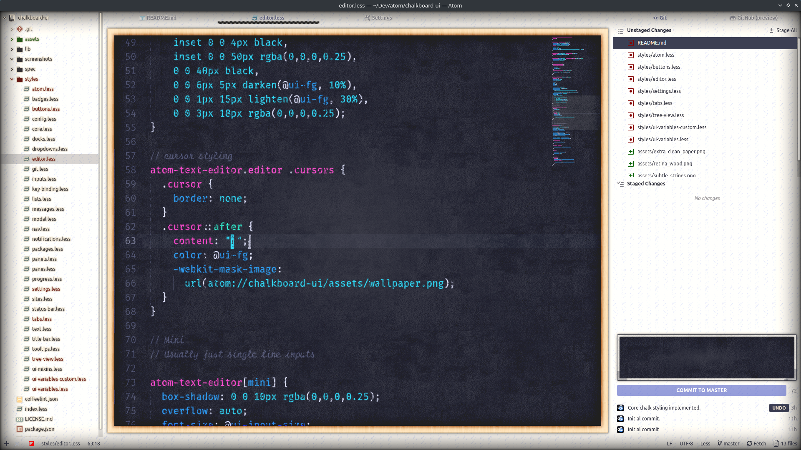
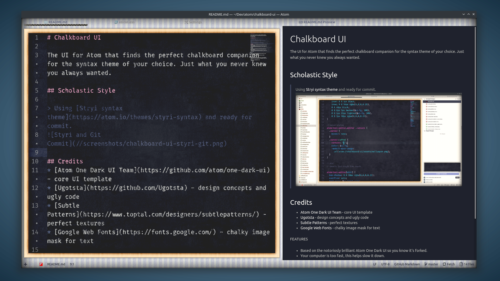
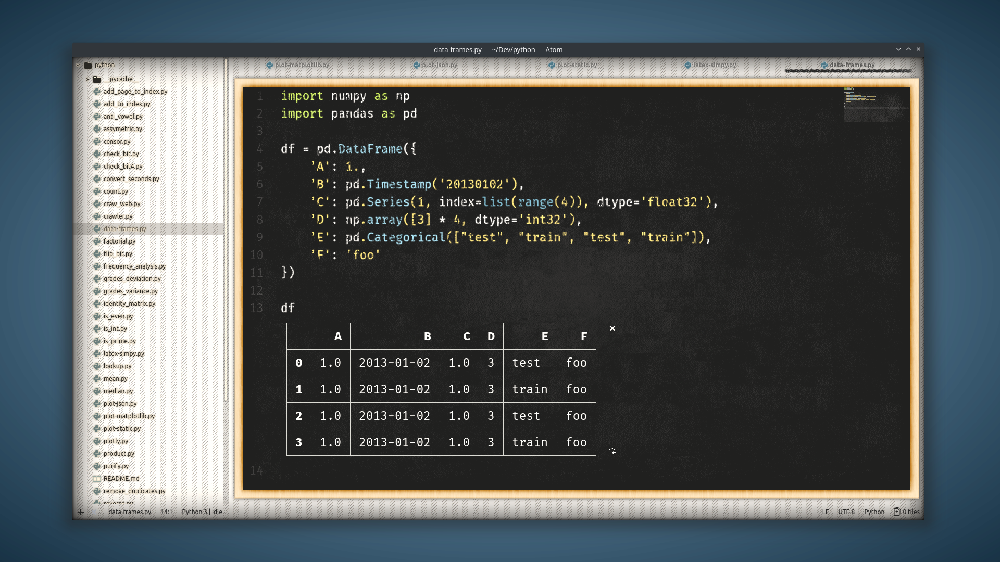

# Chalkboard UI

The UI for Atom that finds the perfect chalkboard companion for the syntax theme of your choice. Just what you never knew you always wanted.

## Scholastic Style

> Readying for commit using [Stryi syntax theme](https://atom.io/themes/styri-syntax).

> Previewing Markdown using [Jackhammer syntax theme](https://atom.io/themes/jackhammer-syntax).

> Inline Python plotting with Hydrogen using [SMYCK Subtle syntax theme](https://atom.io/packages/smyck-subtle-syntax).

## Credits
* [Atom One Dark UI Team](https://github.com/atom/one-dark-ui) - core UI template
* [Ugotsta](https://github.com/Ugotsta) - design concepts and ugly code
* [Subtle Patterns](https://www.toptal.com/designers/subtlepatterns/) - perfect textures
* [Google Web Fonts](https://fonts.google.com/) - chalky image mask for text

FEATURES
* Based on the notoriosly brilliant Atom One Dark UI so you know it's forked.
* Your computer is too fast, this helps slow it down.

KNOWN BUGS
* Textures don't scroll with content like on real chalkboards
* Extensive use of CSS styles make it impossible to port to VS Code
* Impervious to fingernails, no fun
* Cockroaches
